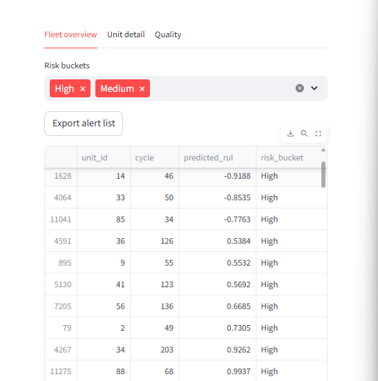
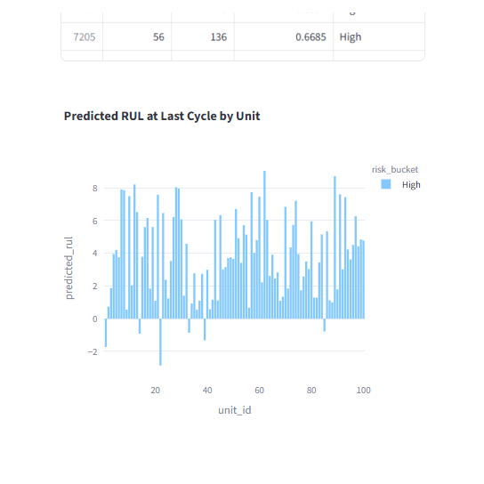
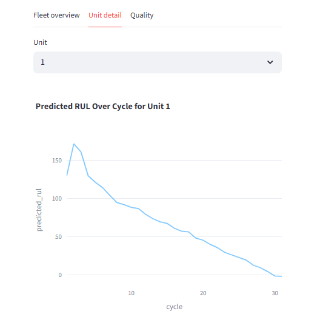
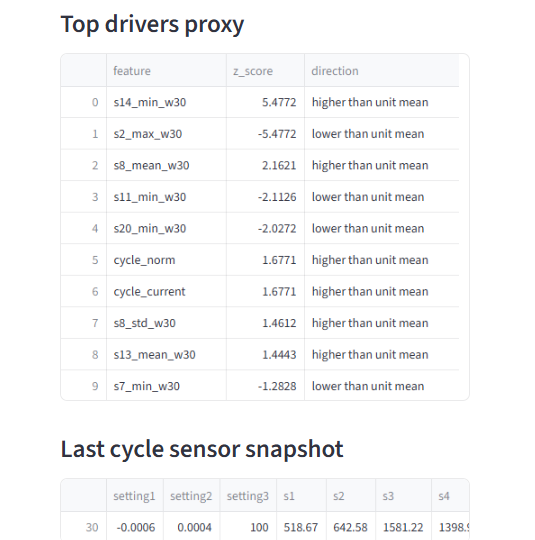

# Predictive Maintenance RUL

Predictive-maintenance-rul is a reproducible baseline pipeline for Remaining Useful Life (RUL) modeling using NASA CMAPSS FD001. It covers ingestion, training, and a Streamlit dashboard for triage, with exportable alerts and a lightweight model card. This repository is designed for learning and experimentation rather than production deployment.

## Live Demo
Streamlit app:

https://pred-maintenance-rul-rauf.streamlit.app/

## Key outputs

- Cleaned, windowed CMAPSS FD001 training and test datasets
- Baseline regressor with saved artifacts and evaluation metrics
- Streamlit dashboard for fleet and unit triage
- Exportable alert list and a model card under `docs/`

## Project structure

```
predictive-maintenance-rul/
  data/
    raw/
    interim/
    processed/
  docs/
    MODEL_CARD.md
    sample_alerts_FD001.csv
  scripts/
  src/
    pm_rul/
  tests/
  artifacts/
```

## Setup (Windows PowerShell)

```powershell
python -m venv .venv
.\.venv\Scripts\Activate.ps1
python -m pip install -U pip
python -m pip install -e .
```

## Data

Place the NASA CMAPSSData.zip file at `data/raw/CMAPSSData.zip`.

## Run demo

```powershell
python -m pm_rul ingest-cmapss --subset FD001
python -m pm_rul train-baseline --subset FD001 --window 30
python -m streamlit run src/pm_rul/dashboard.py
```

## Artifacts explained

Generated data and artifacts are created locally and are not committed to git.

Default output path:
- `artifacts/baseline_fd001_w30/`

Typical files created under the output path:
- `model.joblib`
- `metrics.json`
- `feature_cols.json`
- `run_metadata.json`
- `MODEL_CARD.md`

Dashboard exports:
- `docs/MODEL_CARD.md`
- `docs/sample_alerts_FD001.csv`

## Quality

Run unit tests locally:

```powershell
python -m pytest -q
```

CI runs the same tests on Python 3.12.

## Limitations and next steps

This is a benchmark proxy dataset, so performance may not reflect real operational conditions. The baseline model is intentionally simple and should be treated as a starting point. Next steps include testing on in-domain data, monitoring drift, calibrating risk thresholds, and adding richer feature engineering.

## Dashboard preview

### Fleet triage
Risk bucket filtering and exportable alert list:



Predicted RUL at last cycle by unit:



### Unit investigation
Predicted RUL trajectory for a selected unit:



Driver proxies (z-scores) and last-cycle sensor snapshot:


